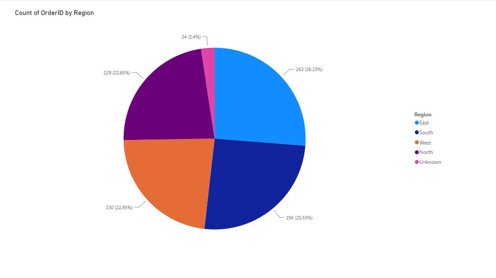
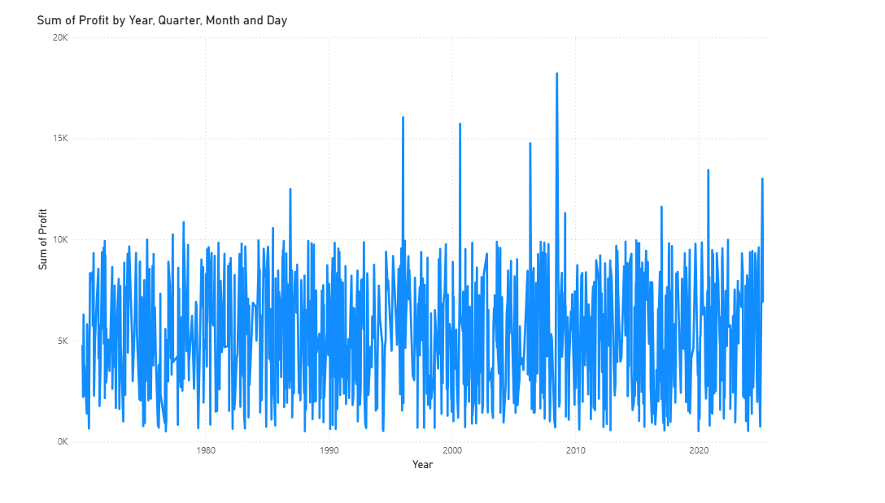

# Codeathon Assessment - DA56

## Project Overview
This repository contains my Codeathon Assessment project completed using Microsoft Power BI. The project involved data cleaning, data transformation, data modeling, DAX calculations, and data visualization.

## Tools & Technologies
- Microsoft Power BI
- Power Query
- DAX

## Project Tasks
- Data Cleaning using Power Query
- Data Transformation using Power Query
- Data Modeling
- Created Calculated Columns using DAX
- Created Calculated Measures using DAX
- Built Data Visualizations

## Visualizations
- Pie Chart – Count of Order ID by Region
- Column Chart – Count of Order ID by Product
- Line Chart – Sum of Profit by Year, Quarter, Month, and Day

## Skills Demonstrated
- Data Cleaning
- Data Transformation
- Data Modeling
- DAX (Calculated Columns & Measures)
- Data Visualization
- Micrososft Power BI

## Author
**Jumana Mohammed Ali**

Aspiring Data Analyst

## Visualizations Preview

### Pie Chart – Count of Order ID by Region

### Line Chart – Sum of Profit by Year, Quarter, Month, and Day

